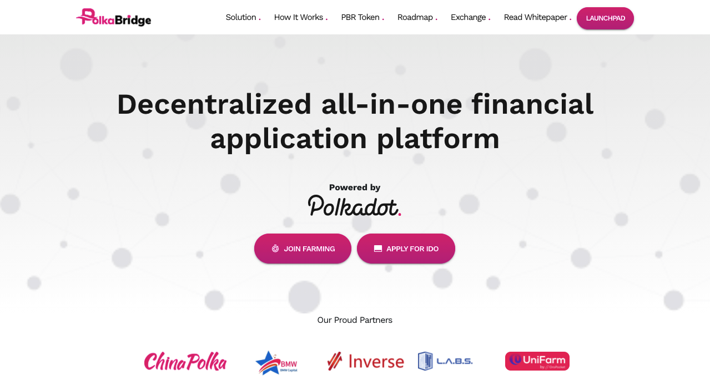

# PolkaBridge - Cross-Chain Dex

With PolkaBridge, you can swap tokens on DOT platform to tokens on other chains and vice versa. Users will be able to earn by adding liquidity, lending, farming and more other ways simply

Following sections are developed:

1. Product Demo
2. Tokenomics & Locking
3. Roadmap
4. Use cases
5. Product MVP
6. Investors
7. Features
8. Working
9. Social Links

## Available Scripts

In the project directory, you can run:

### `yarn start`

Runs the app in the development mode.\
Open [http://localhost:3000](http://localhost:3000) to view it in the browser.

The page will reload if you make edits.\
You will also see any lint errors in the console.

### `yarn build`

Builds the app for production to the `build` folder.\
It correctly bundles React in production mode and optimizes the build for the best performance.

The build is minified and the filenames include the hashes.\
Your app is ready to be deployed!

See the section about [deployment](https://facebook.github.io/create-react-app/docs/deployment) for more information.

